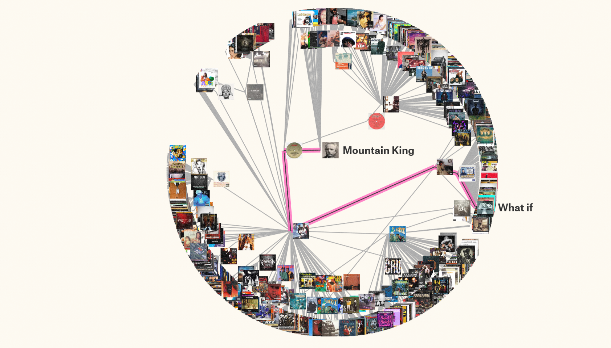
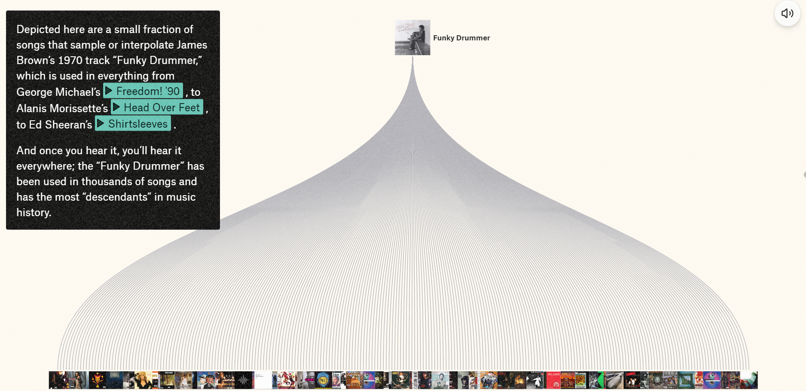
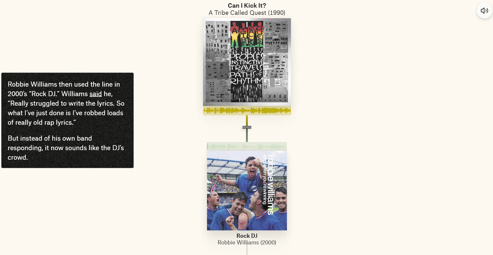
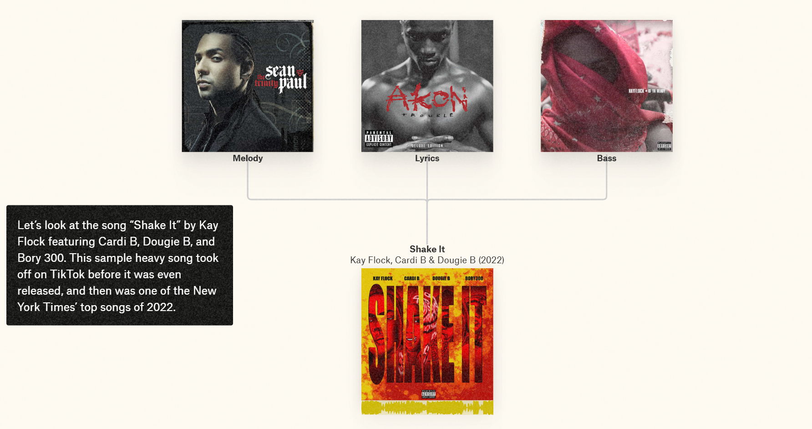

# Music DNA Legacies
## URL 
[Music DNA Legacies](https://pudding.cool/2025/04/music-dna/)

## Descripción de la historia
La webstory aborda los legados compartidos en la música y busca responder la pregunta: “¿Y si los sonidos más emblemáticos de hoy no son solo de hoy?”. Esta historia narra cómo los sonidos se traspasan de generación en generación, y analiza la evolución de una selección de canciones. Por ejemplo, evidencia cómo música orquestal de 1875 *(In The Hall of the Mountain King)* se convirtió en música electrónica en 1983 *(Inspector Gadget)* y, posteriormente, en una melodía de rap en 1985 *(Bad Boys)*, que derivó en la canción *Big Poppa* de Notorious B.I.G en 1995. 

 En su narrativa, __*Music DNA Legacies*__, también considera otras aristas para mostrar las conexiones que hay en la música: indaga cómo una canción puede ser directamente sampleada, cómo las letras de estas canciones pueden traspasarse a través de los años o cómo una canción puede tomar elementos de otras para ser creada.

* En la siguiente imagen pueden apreciarse las canciones que provienen de *In The Hall of the Mountain King* de Edvard Grieg.

* En esta imagen, se visualizan algunas canciones que samplearon o “interpolaron” *Funky Drummer* de James Brown (1970).

* Acá, por ejemplo, se evidencia cómo la canción *Rock DJ* (2000) utiliza la letra de la canción *Can I Kick It?* (1990), que a su vez se basó en *Walk on the Wild Side* de Lou Reed (1972). 

* Por último, este gráfico muestra que la canción *Shake It* (2022) ocupa la melodía, la letra y el bajo de 3 canciones diferentes.

## ¿Qué destaca de su estructura narrativa?
La estructura de la historia está muy bien organizada. Inmediatamente se inicia con un enganche, donde se puede escuchar el origen de la melodía de *Not Like Us* de Kendric Lamar (2024). Asimismo, el estilo narrtivo se mantiene durante toda la webstory y considero que este va de menos a más. Al comienzo, oyes las similitudes que hay entre dos o tres melodías y, de a poco, vas descubriendo que estas se van conectando con muchas otras. Es lo que ocurre con *In The Hall of the Mountain King*, que, más adelante, se relaciona con éxitos como *Hit ´Em Up* de 2pac debido a samples, "interpolaciones" o remezclas. Además, se ordenan los tipos de conexiones musicales a través de apartados que se presentan como "borrowed beats", "loaned lyrics" y "multipurpose melodies".

## Efectividad para transmitir la información
La información logra ser transmitida de forma dinámica y concisa. Asimismo, un elemento que destacaría es que la interacción con el usuario se vuelve indespensable para entender lo que plantea la webstory. Por lo mismo, la historia requiere un buen equilibrio entre imágenes y texto, donde ambos elementos se complementen. Sería muy poco atractivo comunicar los resultados sin las portadas de las canciones o el propio sonido, porque no se entendería el ADN musical.

Por otra parte, los gráficos son súper claros y fáciles de entender. Sin embargo, creo que hubiera sido ideal que, al pasar el cursor por los gráficos más grandes, aparecieran los nombres de las canciones. Así uno puede corroborar que la información que se visualiza conincide con la narrativa. 

## ¿Por qué me pareció interesante? 
La webstory es completamente inmersiva y el tema me parece entretenido. Por otra parte, desde el inicio se plantea una interacción con el usuario, dado que se da la opción de escuchar las canciones que aparecen mientras visualizas la historia. Creo que esto también tiene un punto a favor, porque si uno elige la opción de “mantener en silencio” la historia ni siquiera podría apreciarse. Asimismo, es impresionante la cantidad de datos que se tuvo que recolectar y verificar para hacer las gráficas de una sola canción. Más allá de eso, el trabajo detrás de esta historia debió ser enorme, porque el listado de canciones que comparten ADN cada día aumenta. 

