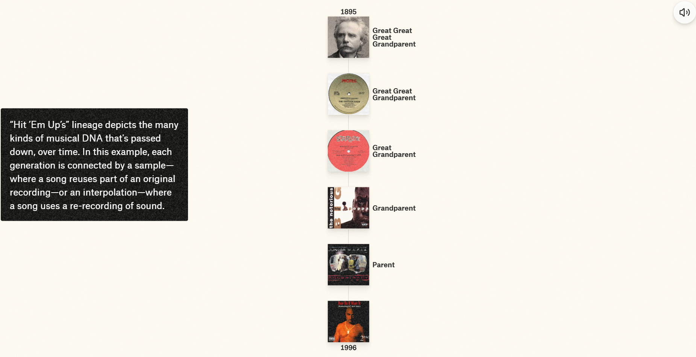

# Music DNA Legacies
## URL 
[Music DNA Legacies](https://pudding.cool/2025/04/music-dna/)

## Descripción de la historia
La webstory aborda los legados compartidos en la música e inicia con la pregunta: “What if today’s most iconic sounds aren’t just from today…”. Esta historia narra cómo los sonidos se traspasan de generación en generación, y analiza la evolución de una selección de canciones. Por ejemplo, evidencia cómo música orquestal de 1875 (*In The Hall of the Mountain King*) se convirtió en música electrónica en 1983 (*Inspector Gadget*) y, posteriormente, en una melodía de rap en 1985 (*Bad Boys*), que derivó en la canción *Big Poppa* de Notorious B.I.G. en 1995. 

 En su narrativa, __*Music DNA Legacies*__, también considera otras aristas para mostrar las conexiones que hay en la música: indaga cómo una canción puede ser sampleada, cómo las letras pueden traspasarse a través de los años o cómo una canción puede tomar elementos de otras para ser creada.

* En esta imagen se visualizan algunas canciones que samplearon o “interpolaron” *Funky Drummer* de James Brown (1970).

* Acá, por ejemplo, se evidencia cómo la canción *Rock DJ* (2000) utiliza la letra de la canción *Can I Kick It?* (1990). 

* Por último, este gráfico muestra que la canción *Shake It* (2022) ocupa la melodía, la letra y el bajo de 3 canciones diferentes.

## ¿Qué destaca de su estructura narrativa?
La estructura de la historia está muy bien organizada. Además, inmediatamente inicia con un gancho, donde se puede escuchar el origen de la melodía de *Not Like Us* de Kendric Lamar (2024). Asimismo, el estilo narrativo se mantiene durante toda la webstory y considero que este va de menos a más. Al comienzo, oyes las similitudes entre dos o tres ritmos y, de a poco, vas descubriendo que estos están conectados con muchas otras canciones. Es lo que ocurre con *Hit ´Em Up* de 2Pac, que, debido a samples, "interpolaciones" o remezclas con otras canciones, logra relacionarse con *In The Hall of the Mountain King*. 

* En la siguiente imagen puede apreciarse la conexión de *Hit ´Em Up* con *In The Hall of the Mountain King* de Edvard Grieg.

Por otra parte, la narrativa también está ordenada según los tipos de conexiones musicales mediante los apartados "Borrowed beats", "Loaned lyrics" y "Multipurpose melodies".

## Efectividad para transmitir la información
La información logra ser transmitida de forma dinámica y concisa. Asimismo, un elemento que destacaría es que la interacción con el usuario se vuelve indispensable para entender lo que plantea la webstory. Por lo mismo, la historia requiere un buen equilibrio entre imágenes y texto, donde ambos elementos se complementen. Sería poco atractivo comunicar los resultados sin las portadas de las canciones o el propio sonido, porque no se entendería el ADN musical.

Por otra parte, los gráficos son claros y fáciles de entender. Sin embargo, creo que hubiera sido ideal que, al pasar el cursor por los gráficos con más información, aparecieran los nombres de las canciones. Así uno podría corroborar por sus propios medios si estos otros sonidos coinciden. 

## ¿Por qué me pareció interesante? 
La webstory es completamente inmersiva y el tema me parece entretenido. Por otra parte, desde el inicio se plantea una interacción con el usuario, dado que se da la opción de escuchar la música mientras visualizas la historia. Creo que esto también tiene un punto a favor, porque si uno elige la opción "stay muted”, la historia ni siquiera podría apreciarse. Asimismo, es impresionante la cantidad de datos que se tuvieron que recolectar y verificar para hacer las gráficas de una sola canción. Más allá de eso, el trabajo detrás de esta historia debió ser enorme, porque cada día aumenta el listado de canciones que comparten ADN. 

